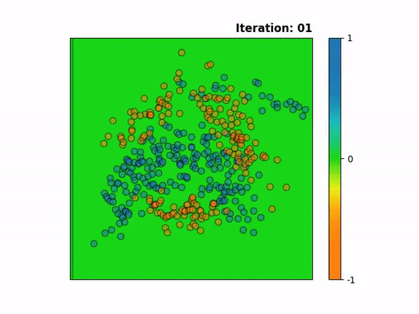

# kalman-jax
Approximate inference for Markov (i.e temporal) Gaussian processes using iterated Kalman filtering and smoothing. Developed and maintained by [**William Wilkinson**](https://twitter.com/wil_j_wil).
The Bernoulli likelihood was implemented by **Paul Chang**. We are based in [**Arno Solin**](https://users.aalto.fi/~asolin/)'s machine learning group at Aalto University, Finland.

This project aims to implement an XLA JIT compilable framework for inference in (non-conjugate) Markov Gaussian processes, with autodiff using [JAX](https://github.com/google/jax).

The methodology is outlined in the following paper:  
W. Wilkinson, P. Chang, M. Riis Andersen, A. *Solin. State Space Expectation Propagation: Efficient Inference Schemes for Temporal Gaussian Processes.* International Conference on Machine Learning (ICML), 2020

If you use this code in your research, please cite the paper as follows:  
```
@inproceedings{wilkinson2020,
  title={State Space Expectation Propagation: Efficient Inference Schemes for Temporal Gaussian Processes},
  author={Wilkinson, William J. and Chang, Paul E. and Andersen, Michael Riis and Solin, Arno},
  booktitle={International Conference on Machine Learning},
  year={2020}
}
```



### We combine two recent advances in the field of probabilistic machine learning:
 - Development of state space methods for linear-time approximate inference in Gaussian processes
 - The ability to JIT compile and autodiff through loops efficiently with JAX

### Code structure
Each approximate inference algorithm will call the same underlying Kalman filter and smoother methods, and will be distinguished by the way in which the approximate likelihood terms are computed.

### Approximate inference algorithms
 - [x] PEP - power expectation propagation
 - [x] EKF - extended Kalman filtering
 - [x] UKF - unscented Kalman filtering
 - [x] GHKF - Gauss-Hermite Kalman filtering
 - [x] SLF - statistical linearisation filter
 - [x] EKS - extended Kalman smoothing
 - [x] UKS - Unscented Kalman smoothing
 - [x] GHKS - Gauss-Hermite Kalman smoothing
 - [x] EEP - Extended EP
 - [x] SLEP - statistically linearised EP
 - [x] UEP - Unscented EP
 - [x] GHEP - Gauss-Hermite EP
 - [x] PL - posterior linearisation
 - [x] VI - variational inference (with natural gradients)
 - [x] STVI - spatio-temporal variational inference
 - [x] STEP - spatio-temporal expectation propagation
 - [x] STKS - spatio-temporal iterated smoothers (E, U, GH)

### Likelihoods
- [x] Gaussian
- [x] Poisson (log-Gaussian Cox process)
- [x] Logit (Bernoulli classification)
- [x] Probit (Bernoulli classification)
- [ ] Heteroschedastic Noise
- [ ] Product (audio amplitude demodulation)

### Priors
- [x] Matern class
- [ ] RBF
- [x] Cosine
- [x] Periodic
- [x] Quasi-periodic
- [x] Subband
- [x] Sum
- [ ] Product
- [x] Independent (multiple stacked components) 
- [ ] Latent force models (linear)
